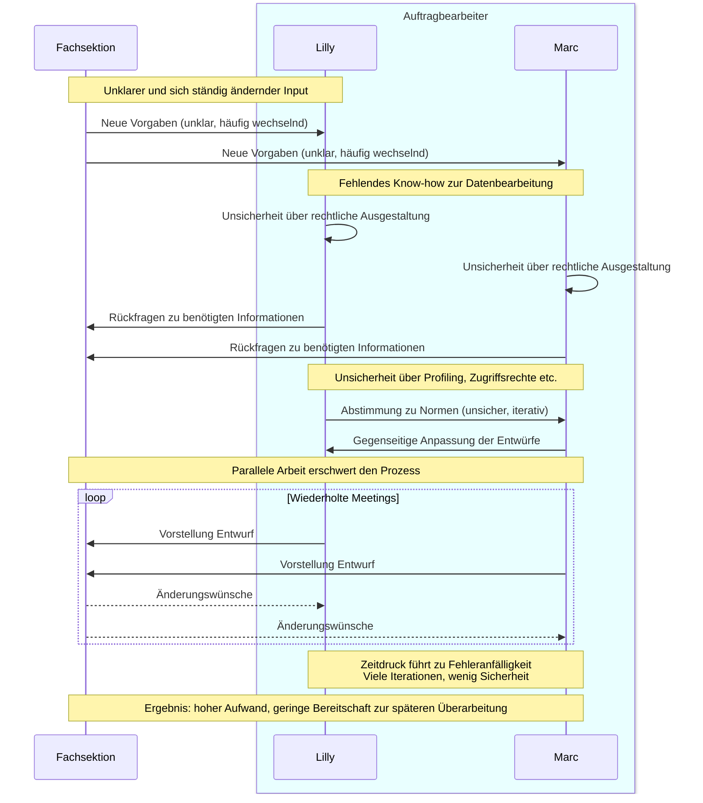

Moien,

kurz für mich für Nachher.

Prozess :

Lösung (Bullet-Points):

- **Schneller, präziser, fehlerfreier Prozess**: Automatisierung ermöglicht eine deutlich effizientere Bearbeitung.
- **Weniger Aufwand, höhere Qualität**: Lilly und Marc arbeiten mit geringerer Belastung und erzielen bessere Ergebnisse.
- **Logische und konsistente Normenerstellung**: Der Prozess folgt klaren Regeln, ohne ständige Nachbesserungen.
- **Echtzeit-Integration von Änderungen**: Alle Beteiligten sind stets auf dem aktuellen Stand.
- **Weniger Anpassungsbedarf**: Änderungen werden automatisch übernommen, was die Sicherheit erhöht.
- **Reduzierung von Abstimmungsmeetings**: Zeitaufwendige Koordination wird durch automatisierte Abläufe ersetzt.
- **Fokus auf rechtliche Inhalte**: Lilly und Marc können sich auf die inhaltliche Qualität statt auf die Koordination konzentrieren.
- **Minimierung von manuellen Fehlern**: Der algorithmische Prozess reduziert typische Bearbeitungsfehler.
- **Sichere Berücksichtigung aller Anforderungen**: Kein wichtiger Aspekt wird übersehen.
- **Zeitliche Effizienzsteigerung**: Normen, die früher Wochen dauerten, werden nun in wenigen Tagen fertiggestellt.

